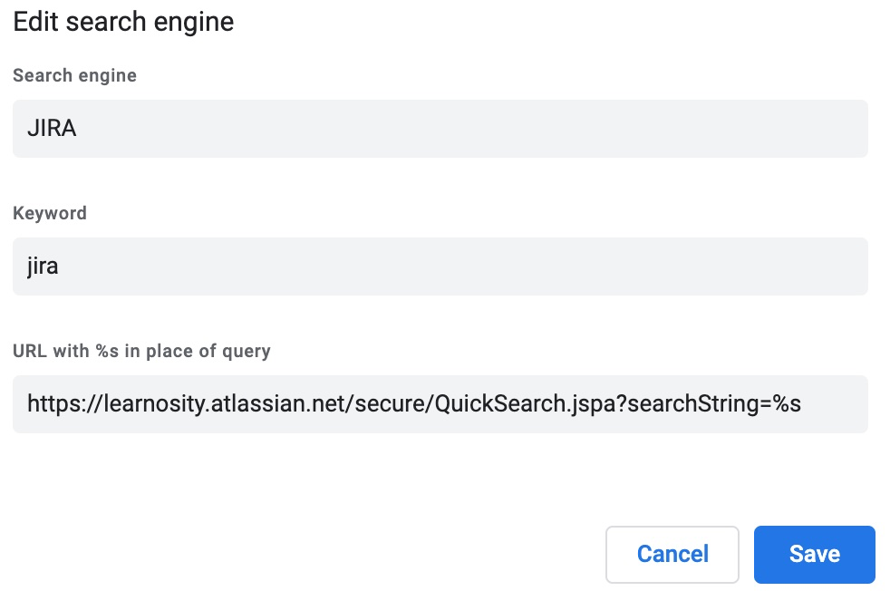

just found out how to add the ability to search and directly access JIRA tickets within Chrome's omnibox and it's super handy 🎉

To enable it go to **Settings > Search Engines > Manage Search Engines** and add a new engine with the details below:

Save the changes and in your omnibox, type in `jira` and press tab, then enter a ticket name and after hitting enter you should be redirected there. And since we are using JIRA's search URL, we can also search for tickets via keywords!

<video controls width="100%">
    <source src="jira-search-engine.webm" type="video/webm">
    <source src="jira-search-engine.mp4" type="video/mp4">
    Sorry, your browser doesn't support embedded videos.
</video>

Works for Firefox, too. I have it a lrn for the shortcut, and mainly use it as lrn 12345 to get straight to the ticket

Works well for searches, but you can construct any url with the %s, you just have to be stricter with what you “search” for with it

Firefox lets you automatically add that on some search fields (not for ZD, though...)
